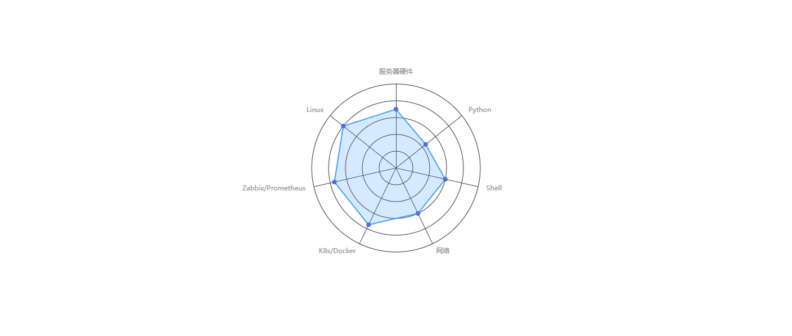
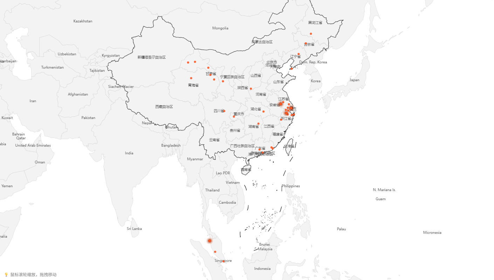
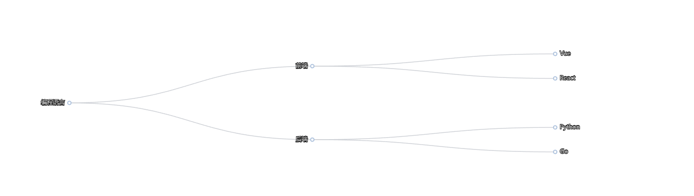
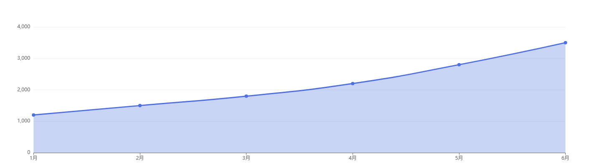
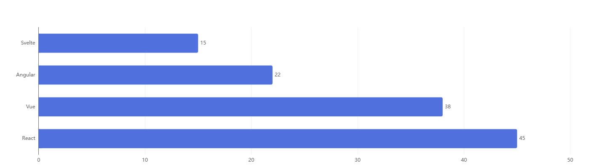

# hexo-next-charts


让博主像写配置一样写图表。通过一行 Tag 指令，将 Markdown 中的 YAML 数据对象映射为 ECharts 视图。

<!-- 效果图展示区域 - 开始 -->
## 效果图

| 雷达图 | 足迹图 | 树图 |
|:---:|:---:|:---:|
|  |  |  |

| 折线图 | 柱状图 | 饼图 |
|:---:|:---:|:---:|
|  |  |  |

<!-- 效果图展示区域 - 结束 -->

---

## 特性

- **简单易用**：一行标签即可生成图表，如 ``、``
- **丰富图表**：支持雷达图、地图、树图、折线图、柱状图、饼图共 6 种常用图表
- **数据解耦**：从 Front-matter 或全局配置中读取数据
- **暗黑模式**：自动适配主题切换（支持 Butterfly, Next 等主流主题）
- **按需加载**：仅在使用图表的页面加载 ECharts 资源
- **自动坐标补全**：只需输入城市名，自动获取经纬度
- **标准城市代码**：支持 UN/LOCODE 和 IATA 代码
- **响应式**：图表自动跟随窗口大小调整

---

## 安装

```bash
npm install hexo-next-charts --save
```

---

## 快速开始

### 1. 配置（可选）

在 Hexo 项目的 `_config.yml` 中配置高德地图 API Key（获取更准确的国内城市定位）：

```yaml
next_charts:
  amap_key: your_amap_key_here  # 可选，不配置则使用 OpenStreetMap
```

### 2. 在文章中添加数据和标签

```yaml
---
skills:
  - { label: "JavaScript", value: 90 }
  - { label: "Python", value: 85 }
  - { label: "Go", value: 75 }
---
```

```markdown

```

---

## 文档

| 文档 | 说明 |
|:---|:---|
| [使用指南](docs/usage.md) | 详细的语法说明和图表示例 |
| [架构设计](docs/architecture.md) | 项目结构和工作流程 |
| [开发与扩展](docs/development.md) | 本地开发测试和自定义图表类型 |

---

## 图表类型速览

| 类型 | 示例标签 | 适用场景 |
|:---|:---|:---|
| 雷达图 | `` | 技能展示、多维数据对比 |
| 足迹图 | `` | 旅行足迹、地点标记 |
| 树图 | `` | 层级关系、技能树 |
| 折线图 | `` | 趋势变化、时间序列 |
| 柱状图 | `` | 数据对比、排名统计 |
| 饼图 | `` | 占比分析、构成展示 |

---

## License

MIT
