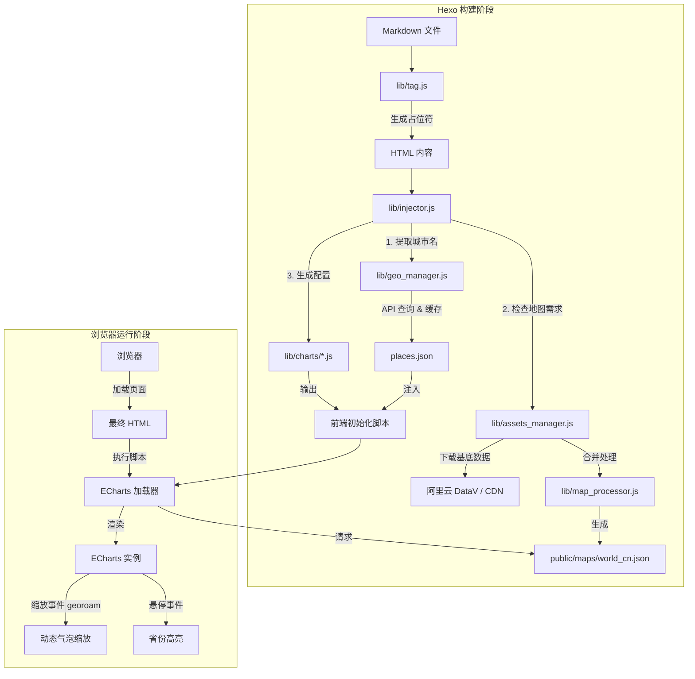

# hexo-next-charts


让博主像写配置一样写图表。通过一行 Tag 指令，将 Markdown 中的 YAML 数据对象映射为 ECharts 视图。

## 🌟 特性

- **简单易用**：一行标签 `` 即可生成图表。
- **数据解耦**：从 Front-matter 或全局配置中读取数据。
- **暗黑模式**：自动适配主题切换（支持 Butterfly, Next 等主流主题）。
- **按需加载**：仅在使用图表的页面加载 ECharts 资源。
- **响应式**：图表自动跟随窗口大小调整。
- **智能地图加载**：自动下载并缓存高精度 GeoJSON，支持 CDN 回退。
- **自动坐标补全**：只需输入城市名（如 "London", "张掖"），构建时自动获取经纬度并注入，无需手动维护坐标文件。
- **标准城市代码**：支持 UN/LOCODE 和 IATA 代码（如 `CN SHA`, `PVG`）。
- **多源数据支持**：自动从高德开放平台 (Amap) 或 OpenStreetMap 获取地理信息。

## 🚀 安装

在你的 Hexo 根目录下运行：

```bash
npm install hexo-next-charts --save
```

## ⚙️ 配置 (可选)

为了获得更准确的国内城市定位，建议在 Hexo 项目的 `_config.yml` 中配置高德地图 API Key（Web服务类型）：

```yaml
next_charts:
  amap_key: your_amap_key_here # 可选，若不配置则默认使用 OpenStreetMap
```

## 📖 语法

```markdown

```

- **type**: 图表类型（支持 `radar`, `map`, `tree`）。
- **data_source**: 数据路径（对应 Front-matter 里的 key）。
- **options**: (可选) 键值对参数，如 `title:"标题"` `height:500px` `map:china`。

### 示例 1：雷达图 (Radar)

**Front-matter:**

```yaml
skills:
  - { label: "Javascript", value: 90 }
  - { label: "Python", value: 85 }
  - { label: "K8s", value: 70 }
```

**Markdown:**

```markdown

```

### 示例 2：足迹图 (Map)

**Front-matter:**

```yaml
travels:
  - "Shanghai" # 自动获取坐标
  - "张掖" # 中文名自动支持
  - "London" # 英文名自动支持
  - { code: "MY PEN", label: "槟城", effect: true } # 混合对象写法
```

**Markdown:**

```markdown

```

> **地图类型说明**：
>
> - `map:world` - 世界地图（主要显示国家边界）
> - `map:china` - 中国地图（高精度，基于阿里云 DataV 数据）
> - `map:world-cn` - **世界 + 中国**（推荐，在世界地图基础上合并了中国详细省界）
>
> **数据格式支持**：
>
> 1. **城市名称（推荐）**：直接使用中文或英文名称，插件会自动查询坐标。
>    - 示例：`"上海"`, `"张掖"`, `"London"`, `"New York"`
> 2. **标准代码**：支持 UN/LOCODE 或 IATA 机场代码。
>    - 示例：`"CN SHA"`, `"PVG"`, `"LAX"`
> 3. **高级对象**：自定义标签或高亮效果。
>    - 示例：`{ name: "Beijing", label: "首都", effect: true }`

### 示例 3：技能树 (Tree)

**Front-matter:**

```yaml
skills_tree:
  name: "编程语言"
  children:
    - name: "前端"
      children: [{ name: "Vue" }, { name: "React" }]
    - name: "后端"
      children: [{ name: "Python" }, { name: "Go" }]
```

**Markdown:**

```markdown

```

---

## 🗺️ 地图资源与坐标管理

插件内置了 **AssetsManager** 和 **GeoManager**，自动化处理地理数据：

1. **地图文件**：自动下载/缓存 ECharts 需要的 GeoJSON 文件（如中国地图、世界地图）。
2. **坐标补全 (Geo-Auto-Resolver)**：
    - 在 `hexo generate` 构建阶段，插件会自动提取文章中出现的城市名称。
    - 自动调用 API（高德/OSM）获取经纬度。
    - 结果缓存至 `source/_data/places.json`，确保构建速度和稳定性。

你无需手动查找经纬度，只需在 Front-matter 中写下城市名字即可。

---

## 📂 项目结构与核心模块说明

本插件采用模块化设计，核心逻辑位于 `lib/` 目录下，主要分为 **构建时处理 (Build-Time)** 和 **运行时渲染 (Runtime)** 两部分。

### 核心文件概览

| 文件路径 | 类型 | 核心职责 |
| :--- | :--- | :--- |
| `index.js` | 入口 | 插件主入口，注册 Hexo Tag (``) 和 Filter (`after_post_render`)。 |
| `lib/tag.js` | 标签解析 | 解析 Markdown 中的标签参数，生成带有 Base64 数据载荷的 HTML 占位符。 |
| `lib/injector.js` | 注入处理 | **核心引擎**。扫描文章中的占位符，调用对应的图表转换器，处理地理坐标，并注入 ECharts 前端加载脚本。 |
| `lib/assets_manager.js` | 资源管理 | 负责下载和缓存外部资源（如 GeoJSON 地图数据）。支持从 AliYun DataV 或 CDN 获取数据。 |
| `lib/map_processor.js` | 地图处理 | **地图合成器**。负责将世界地图 (`world.json`)、中国地图 (`china.json`) 和国界轮廓 (`china-contour.json`) 合并为高质量的 `world_cn.json`。 |
| `lib/geo_manager.js` | 坐标管理 | 负责城市名称到经纬度的自动转换。调用高德/OSM API，并缓存结果到 `places.json`。 |
| `lib/store_adapter.js` | 缓存适配 | **数据持久化**。封装了对本地 JSON 缓存文件（如 `places.json`）的读写操作，提供统一的数据存取接口。 |
| `lib/coord_helper.js` | 坐标转换 | **算法工具**。提供 GCJ-02 (高德/腾讯) 到 WGS-84 (GPS/国际标准) 的坐标系转换算法，纠正国内地图 API 的偏移。 |
| `lib/charts/*.js` | 图表定义 | **转换器**。将用户在 Front-matter 中的 YAML 数据转换为 ECharts 的 `option` 配置对象。目前包含 `map.js` (地图), `radar.js` (雷达图), `tree.js` (树图)。 |

### 🔄 工作流程架构图



---

## 🛠 开发与测试

如果你想修改插件或贡献代码，可以按以下步骤在本地 Hexo 环境中进行测试：

### 1. 准备插件源码

确保你在 `hexo-next-charts` 目录中。

安装所有依赖（包括 devDependencies）：

```bash
npm install
```

### 2. 运行 CI 检查

提交代码前，请务必运行以下命令确保通过 CI 检查：

```bash
# 运行 ESLint 代码检查
npm run lint

# 运行自动化测试
npm test

# 运行逻辑验证脚本
node tests/verify.js
```

### 3. 链接到 Hexo 项目

在你的 **Hexo 博客根目录**中，使用 `npm link` 挂载本地开发的插件：

```bash
# 在 hexo-next-charts 目录运行
npm link

# 进入你的 Hexo 博客根目录运行
npm link hexo-next-charts
```

### 3. 配置测试数据

在 Hexo 的一篇文章中添加点测试数据：

```yaml
---
title: Chart Test
layout: post
my_chart_data:
  - { label: "A", value: 50 }
  - { label: "B", value: 80 }
---
{ % echart radar my_chart_data % }
```

### 4. 运行 Hexo

```bash
hexo clean && hexo s
```

打开浏览器访问 `http://localhost:4000` 查看效果。

### 5. 运行内置验证脚本

本仓库提供了一个简单的脚本来验证核心逻辑（数据解析、标签渲染、注入逻辑）：

```bash
node verify.js
```

## 扩展图表

你可以通过在 `lib/charts/` 目录下添加新的 JS 文件来扩展图表类型。每个文件导出一个函数，接收原始数据并返回 ECharts 的 `option` 对象。

---

## License

MIT
