# hexo-next-charts


让博主像写配置一样写图表。通过一行 Tag 指令，将 Markdown 中的 YAML 数据对象映射为 ECharts 视图。

## 🌟 特性

- **简单易用**：一行标签即可生成图表，如 ``、``。
- **丰富图表**：支持雷达图、地图、树图、折线图、柱状图、饼图共 6 种常用图表。
- **数据解耦**：从 Front-matter 或全局配置中读取数据。
- **暗黑模式**：自动适配主题切换（支持 Butterfly, Next 等主流主题）。
- **按需加载**：仅在使用图表的页面加载 ECharts 资源。
- **散点抖动**：当地图上有 8 个以上标记点时，自动启用 ECharts v6 的 jitter 功能防止重叠。
- **响应式**：图表自动跟随窗口大小调整。
- **智能地图加载**：自动下载并缓存高精度 GeoJSON，支持 CDN 回退。
- **自动坐标补全**：只需输入城市名（如 "London", "张掖"），构建时自动获取经纬度并注入，无需手动维护坐标文件。
- **标准城市代码**：支持 UN/LOCODE 和 IATA 代码（如 `CN SHA`, `PVG`）。
- **多源数据支持**：自动从高德开放平台 (Amap) 或 OpenStreetMap 获取地理信息。

## 🚀 安装

在你的 Hexo 根目录下运行：

```bash
npm install hexo-next-charts --save
```

## ⚙️ 配置 (可选)

### 基础配置

为了获得更准确的国内城市定位，建议在 Hexo 项目的 `_config.yml` 中配置高德地图 API Key（Web服务类型）：

```yaml
next_charts:
  amap_key: your_amap_key_here # 可选，若不配置则默认使用 OpenStreetMap
```

### ECharts 版本配置

**插件已默认使用 ECharts v6.0.0**。

```yaml
next_charts:
  amap_key: your_amap_key_here
  echarts:
    # 自定义 ECharts CDN 地址（默认使用 v6.0.0）
    cdn: https://cdn.jsdelivr.net/npm/echarts@6.0.0/dist/echarts.min.js
    # 自定义地图 CDN 回退地址
    map_cdn:
      world: https://cdn.jsdelivr.net/npm/echarts/map/js/world.js
      china: https://cdn.jsdelivr.net/npm/echarts/map/js/china.js
```

**使用其他 CDN：**

```yaml
next_charts:
  echarts:
    cdn: https://unpkg.com/echarts@6.0.0/dist/echarts.min.js
    # 或
    cdn: https://cdnjs.cloudflare.com/ajax/libs/echarts/6.0.0/echarts.min.js
```

## 📖 语法

```markdown

```

- **type**: 图表类型（支持 `radar`, `map`, `tree`, `line`, `bar`, `pie`）。
- **data_source**: 数据路径（对应 Front-matter 里的 key）。
- **options**: (可选) 键值对参数，如 `title:"标题"` `height:500px` `map:china`。

### 示例 1：雷达图 (Radar)

**Front-matter:**

```yaml
skills:
  - { label: "Javascript", value: 90 }
  - { label: "Python", value: 85 }
  - { label: "K8s", value: 70 }
```

**Markdown:**

```markdown

```

### 示例 2：足迹图 (Map)

**Front-matter:**

```yaml
travels:
  - "Shanghai" # 自动获取坐标
  - "张掖" # 中文名自动支持
  - "London" # 英文名自动支持
  - { code: "MY PEN", label: "槟城", effect: true } # 混合对象写法
```

**Markdown:**

```markdown

```

> **地图类型说明**：
>
> - `map:world` - 世界地图（主要显示国家边界）
> - `map:china` - 中国地图（高精度，基于阿里云 DataV 数据）
> - `map:world-cn` - **世界 + 中国**（推荐，在世界地图基础上合并了中国详细省界）
>
> **数据格式支持**：
>
> 1. **城市名称（推荐）**：直接使用中文或英文名称，插件会自动查询坐标。
>    - 示例：`"上海"`, `"张掖"`, `"London"`, `"New York"`
> 2. **标准代码**：支持 UN/LOCODE 或 IATA 机场代码。
>    - 示例：`"CN SHA"`, `"PVG"`, `"LAX"`
> 3. **高级对象**：自定义标签或高亮效果。
>    - 示例：`{ name: "Beijing", label: "首都", effect: true }`

### 示例 3：技能树 (Tree)

**Front-matter:**

```yaml
skills_tree:
  name: "编程语言"
  children:
    - name: "前端"
      children: [{ name: "Vue" }, { name: "React" }]
    - name: "后端"
      children: [{ name: "Python" }, { name: "Go" }]
```

**Markdown:**

```markdown

```

### 示例 4：折线图 (Line)

**Front-matter:**

```yaml
monthly_visits:
  - { label: "1月", value: 1200 }
  - { label: "2月", value: 1500 }
  - { label: "3月", value: 1800 }
  - { label: "4月", value: 2200 }
  - { label: "5月", value: 2800 }
  - { label: "6月", value: 3500 }
```

**Markdown:**

```markdown

```

### 示例 5：柱状图 (Bar)

**Front-matter:**

```yaml
framework_stats:
  - { label: "React", value: 45 }
  - { label: "Vue", value: 38 }
  - { label: "Angular", value: 22 }
  - { label: "Svelte", value: 15 }
```

**Markdown:**

```markdown

```

### 示例 6：饼图 (Pie)

**Front-matter:**

```yaml
expense_breakdown:
  - { name: "交通", value: 3500, color: "#5470c6" }
  - { name: "住宿", value: 2400, color: "#91cc75" }
  - { name: "餐饮", value: 1800, color: "#fac858" }
  - { name: "门票", value: 800, color: "#ee6666" }
  - { name: "购物", value: 1200, color: "#73c0de" }
```

**Markdown:**

```markdown

```

> **饼图变体**：
>
> - 普通饼图：`radius: ["0%", "70%"]`
> - 甜甜圈图：`radius: ["40%", "70%"]`（默认）
> - 玫瑰图：`roseType:"radius"`
> - 南丁格尔图：`roseType:"area"`

---

## 🗺️ 地图资源与坐标管理

插件内置了 **AssetsManager** 和 **GeoManager**，自动化处理地理数据：

1. **地图文件**：自动下载/缓存 ECharts 需要的 GeoJSON 文件（如中国地图、世界地图）。
2. **坐标补全 (Geo-Auto-Resolver)**：
    - 在 `hexo generate` 构建阶段，插件会自动提取文章中出现的城市名称。
    - 自动调用 API（高德/OSM）获取经纬度。
    - 结果缓存至 `source/_data/places.json`，确保构建速度和稳定性。

你无需手动查找经纬度，只需在 Front-matter 中写下城市名字即可。

---

## 📂 项目结构与核心模块说明

本插件采用模块化设计，核心逻辑位于 `lib/` 目录下，主要分为 **构建时处理 (Build-Time)** 和 **运行时渲染 (Runtime)** 两部分。

### 核心文件概览

| 文件路径 | 类型 | 核心职责 |
| :--- | :--- | :--- |
| `index.js` | 入口 | 插件主入口，注册 Hexo Tag (``) 和 Filter (`after_post_render`)，初始化 ChartRegistry。 |
| `lib/tag.js` | 标签解析 | 解析 Markdown 中的标签参数，生成带有 Base64 数据载荷的 HTML 占位符。 |
| `lib/injector.js` | 注入处理 | **协调器**。扫描文章中的占位符，通过 ChartRegistry 调用对应转换器，处理地理坐标，并注入前端脚本。 |
| `lib/chart_registry.js` | 注册中心 | **图表注册中心**。维护图表类型到转换器的映射，支持动态注册，自动扫描加载 charts 目录。 |
| `lib/charts/base.js` | 基类 | **转换器基类**。定义统一接口 `validate()`, `transform()`, `mergeConfig()`，提供配置合并和通用构建方法。 |
| `lib/config_merger.js` | 配置合并 | **配置合并器**。深度合并默认配置和用户配置，处理 ECharts Option 的特殊合并逻辑。 |
| `lib/frontend_script_builder.js` | 脚本构建 | **前端脚本生成器**。生成 ECharts 加载和初始化脚本，分离模板与逻辑。 |
| `lib/utils/path_resolver.js` | 工具 | **路径工具**。提供 dot-notation 路径解析、URL 拼接等通用工具函数。 |
| `lib/assets_manager.js` | 资源管理 | 负责下载和缓存外部资源（如 GeoJSON 地图数据）。支持从 AliYun DataV 或 CDN 获取数据。 |
| `lib/map_processor.js` | 地图处理 | **地图合成器**。负责将世界地图 (`world.json`)、中国地图 (`china.json`) 和国界轮廓 (`china-contour.json`) 合并为高质量的 `world_cn.json`。 |
| `lib/geo_manager.js` | 坐标管理 | 负责城市名称到经纬度的自动转换。调用高德/OSM API，并缓存结果到 `places.json`。 |
| `lib/store_adapter.js` | 缓存适配 | **数据持久化**。封装了对本地 JSON 缓存文件（如 `places.json`）的读写操作，提供统一的数据存取接口。 |
| `lib/coord_helper.js` | 坐标转换 | **算法工具**。提供 GCJ-02 (高德/腾讯) 到 WGS-84 (GPS/国际标准) 的坐标系转换算法，纠正国内地图 API 的偏移。 |
| `lib/charts/*.js` | 图表定义 | **转换器**。继承 BaseTransformer，将 YAML 数据转换为 ECharts 的 `option` 配置对象。目前包含 `map.js` (地图), `radar.js` (雷达图), `tree.js` (树图)。 |

### 🔄 工作流程架构图

```mermaid
flowchart TD
    %% 阶段划分
    subgraph BuildTime [Hexo 构建阶段]
        MD[Markdown 文件] --> Tag[lib/tag.js]
        Tag -->|生成占位符| Content[HTML 内容]

        Content --> Injector[lib/injector.js]

        Injector -->|1. 提取城市名| GeoMgr[lib/geo_manager.js]
        GeoMgr -->|API 查询 & 缓存| Places[places.json]

        Injector -->|2. 检查地图需求| AssetsMgr[lib/assets_manager.js]
        AssetsMgr -->|下载基底数据| AliYun[阿里云 DataV / CDN]
        AssetsMgr -->|合并处理| MapProc[lib/map_processor.js]
        MapProc -->|生成| WorldCN[public/maps/world_cn.json]

        Injector -->|3. 查询转换器| Registry[lib/chart_registry.js]
        Registry -->|加载| ChartTrans[lib/charts/*.js]
        ChartTrans -->|继承| BaseTrans[lib/charts/base.js]
        ChartTrans -->|使用| ConfigMerger[lib/config_merger.js]
        ChartTrans -->|输出| Script[前端初始化脚本]

        Injector -->|4. 构建脚本| ScriptBuilder[lib/frontend_script_builder.js]
        ScriptBuilder -->|生成| Script
    end

    subgraph Runtime [浏览器运行阶段]
        Browser[浏览器] -->|加载页面| HTML[最终 HTML]
        HTML -->|执行脚本| EChartsLoader[ECharts 加载器]
        EChartsLoader -->|请求| WorldCN
        EChartsLoader -->|渲染| Canvas[ECharts 实例]

        %% 交互逻辑
        Canvas -->|缩放事件 georoam| ZoomHandler[动态气泡缩放]
        Canvas -->|悬停事件| HoverHandler[省份高亮]
    end

    %% 数据流向
    Script --> EChartsLoader
    Places -->|注入| Script
```



---

## 🛠 开发与测试

如果你想修改插件或贡献代码，可以按以下步骤在本地 Hexo 环境中进行测试：

### 1. 准备插件源码

确保你在 `hexo-next-charts` 目录中。

安装所有依赖（包括 devDependencies）：

```bash
npm install
```

### 2. 运行 CI 检查

提交代码前，请务必运行以下命令确保通过 CI 检查：

```bash
# 运行 ESLint 代码检查
npm run lint

# 运行自动化测试
npm test

# 运行逻辑验证脚本
node tests/verify.js
```

### 3. 链接到 Hexo 项目

在你的 **Hexo 博客根目录**中，使用 `npm link` 挂载本地开发的插件：

```bash
# 在 hexo-next-charts 目录运行
npm link

# 进入你的 Hexo 博客根目录运行
npm link hexo-next-charts
```

### 3. 配置测试数据

在 Hexo 的一篇文章中添加点测试数据：

```yaml
---
title: Chart Test
layout: post
my_chart_data:
  - { label: "A", value: 50 }
  - { label: "B", value: 80 }
---
{ % echart radar my_chart_data % }
```

### 4. 运行 Hexo

```bash
hexo clean && hexo s
```

打开浏览器访问 `http://localhost:4000` 查看效果。

### 5. 运行内置验证脚本

本仓库提供了一个简单的脚本来验证核心逻辑（数据解析、标签渲染、注入逻辑）：

```bash
node verify.js
```

## 扩展图表

你可以通过在 `lib/charts/` 目录下添加新的 JS 文件来扩展图表类型。插件使用 **ChartRegistry** 自动扫描并注册图表转换器。

### 快速创建新图表类型

继承 `BaseTransformer` 基类，实现三个核心方法：

```javascript
// lib/charts/my_chart.js
const BaseTransformer = require('./base');

class MyChartTransformer extends BaseTransformer {
    /**
     * 返回默认配置
     */
    getDefaultConfig() {
        return {
            backgroundColor: 'transparent',
            // ... 其他默认配置
        };
    }

    /**
     * 验证输入数据
     */
    validate(data) {
        if (!Array.isArray(data)) {
            return { valid: false, error: 'Data must be an array' };
        }
        return { valid: true };
    }

    /**
     * 转换数据为 ECharts Option
     */
    transform(data) {
        const config = this.mergeConfig(this.config);

        // 构建 ECharts Option
        const option = {
            series: [{
                type: 'line', // 或其他图表类型
                data: data
            }]
        };

        // 允许用户通过 option 参数覆盖任意配置
        return this.merger.merge(option, config.option || {});
    }
}

// 导出工厂函数（必需，用于 ChartRegistry 自动加载）
module.exports = function(data, config = {}) {
    return new MyChartTransformer(config).transform(data);
};

// 可选：导出类以便直接实例化
module.exports.MyChartTransformer = MyChartTransformer;
```

### 特性说明

1. **自动注册**：将文件放入 `lib/charts/` 目录即可自动加载，无需修改其他代码
2. **配置合并**：用户可通过 `option:{...}` 参数覆盖任意 ECharts 配置
3. **验证支持**：在 `validate()` 中实现数据校验，失败时会输出友好错误信息
4. **工具方法**：基类提供 `buildTitle()`, `buildTooltip()`, `buildToolbox()` 等便捷方法

### 使用示例

创建文件后，立即可以在 Markdown 中使用：

```markdown

```

---

## License

MIT
