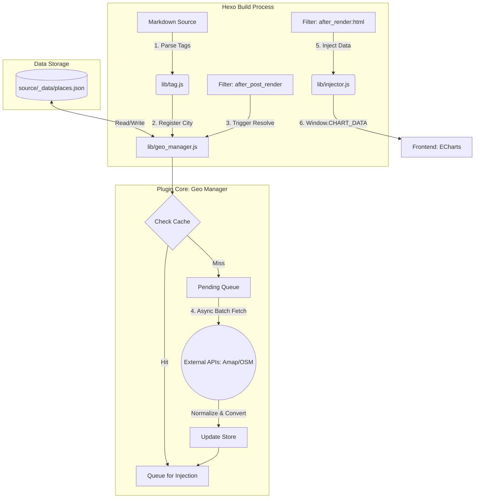
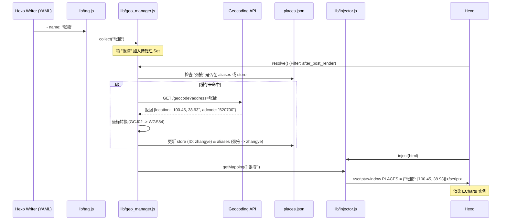

# 插件设计文档：地理数据自动化补全模块 (Geo-Auto-Resolver)

## 1. 概述

本模块旨在解决在 Hexo 静态博客中展示地图时，手动维护经纬度坐标（places.json）繁琐且易出错的问题。通过“本地缓存优先 + 公网异步补全”的策略，实现用户仅需在 YAML 中输入城市名称，即可自动获取并持久化地理坐标。

## 2. 核心架构设计

### 2.1 模块职责划分

- 声明层 (Tag/YAML): 提供直观的用户接口，收集原始城市字符串。
- 调度层 (GeoManager): 核心逻辑单元，执行缓存查找、别名匹配及 API 请求。
- 持久化层 (Store): 维护归一化的 places.json。
- 注入层 (Injector): 将计算结果解耦并注入前端环境。

### 2.2 数据模型（Schema）

`places.json` 采用“实体库 + 别名表”结构，确保数据不冗余。

```json
{
  "store": {
    "zhangye": {
      "name_cn": "张掖市",
      "coords": [100.45, 38.93],
      "source": "amap"
    }
  },
  "aliases": {
    "张掖": "zhangye",
    "张掖市": "zhangye",
    "zhangye": "zhangye"
  }
}
```

## 3. 工作流程 (Workflow)

### 3.1 收集阶段 (Collect)

在 Hexo 渲染 tag 时，将所有发现的城市名存入内存中的 Set。

- 触发点: hexo.extend.tag.register
- 动作: geoManager.push(rawName)

### 3.2 补全阶段 (Resolve)

在所有文章处理完毕后，统一进行异步补全。

- 触发点: after_post_render (Filter)
- 逻辑控制:
  1. 洗涤 (Clean): 移除空白符、行政后缀（省/市/县）。
  2. 命中测试: 先查 aliases，再查 store。
  3. 异步获取: 若未命中，批量调用外部 API（高德/OSM）。
  4. 规范化: 统一坐标系为 WGS-84。

### 3.3 注入阶段 (Inject)

- 触发点: after_render:html
- 动作: 仅提取当前页面所需的城市坐标，注入为 window.CHART_DATA。

## 4. 关键算法与策略

### 4.1 归一化逻辑 (Normalization)

```javascript
function normalize(name) {
  return name
    .trim()
    .toLowerCase()
    .replace(/(省|市|区|州|县|自治[州县])$/g, "");
}
```

### 4.2 并发控制 (Concurrency Control)

为避免 API 请求过快导致被封禁或构建性能抖动，采用 Promise 队列：

- 策略: 使用 p-limit 限制并发请求数为 3-5 个。
- 重试: 针对网络抖动实现 3 次自动重试机制。

### 4.3 故障处理 (Fail-safe)

- API 降级: 若高德 API 失败，尝试降级到 OpenStreetMap 或保持坐标缺失（不中断构建）。
- 手动覆盖: 如果 YAML 中显式写了 coords: [x, y]，则强制跳过自动补全。

## 5. 模块代码结构建议

```
lib/
├── geo_manager.js    # 异步调度中心 (Class GeoManager)
├── api_client.js     # 封装 axios 请求高德/OSM
├── coord_helper.js   # 坐标转换工具 (GCJ02 to WGS84)
└── store_adapter.js  # 负责读写 source/_data/places.json
```

## 6. 流程/架构

### 6.1 插件架构图



### 6.2 数据补全流程图 (Workflow)



## 7. 后续扩展方向

1. 多源支持: 增加对 IATA (机场代码) 和 UN/LOCODE (贸易港口) 的特殊匹配逻辑。
2. 可视化校验: 在控制台打印构建报告（例如：✔ 已自动补全 5 个城市坐标，缓存命中 12 个）。
