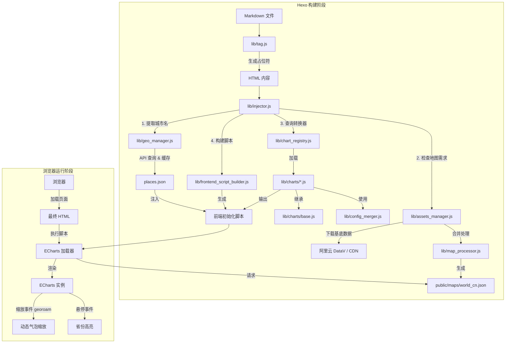

# 架构设计

## 项目结构

本插件采用模块化设计，核心逻辑位于 `lib/` 目录下，主要分为 **构建时处理 (Build-Time)** 和 **运行时渲染 (Runtime)** 两部分。

### 核心文件概览

| 文件路径 | 类型 | 核心职责 |
| :--- | :--- | :--- |
| `index.js` | 入口 | 插件主入口，注册 Hexo Tag (``) 和 Filter (`after_post_render`)，初始化 ChartRegistry。 |
| `lib/tag.js` | 标签解析 | 解析 Markdown 中的标签参数，生成带有 Base64 数据载荷的 HTML 占位符。 |
| `lib/injector.js` | 注入处理 | **协调器**。扫描文章中的占位符，通过 ChartRegistry 调用对应转换器，处理地理坐标，并注入前端脚本。 |
| `lib/chart_registry.js` | 注册中心 | **图表注册中心**。维护图表类型到转换器的映射，支持动态注册，自动扫描加载 charts 目录。 |
| `lib/charts/base.js` | 基类 | **转换器基类**。定义统一接口 `validate()`, `transform()`, `mergeConfig()`，提供配置合并和通用构建方法。 |
| `lib/config_merger.js` | 配置合并 | **配置合并器**。深度合并默认配置和用户配置，处理 ECharts Option 的特殊合并逻辑。 |
| `lib/frontend_script_builder.js` | 脚本构建 | **前端脚本生成器**。生成 ECharts 加载和初始化脚本，分离模板与逻辑。 |
| `lib/utils/path_resolver.js` | 工具 | **路径工具**。提供 dot-notation 路径解析、URL 拼接等通用工具函数。 |
| `lib/assets_manager.js` | 资源管理 | 负责下载和缓存外部资源（如 GeoJSON 地图数据）。支持从 AliYun DataV 或 CDN 获取数据。 |
| `lib/map_processor.js` | 地图处理 | **地图合成器**。负责将世界地图 (`world.json`)、中国地图 (`china.json`) 和国界轮廓 (`china-contour.json`) 合并为高质量的 `world_cn.json`。 |
| `lib/geo_manager.js` | 坐标管理 | 负责城市名称到经纬度的自动转换。调用高德/OSM API，并缓存结果到 `places.json`。 |
| `lib/store_adapter.js` | 缓存适配 | **数据持久化**。封装了对本地 JSON 缓存文件（如 `places.json`）的读写操作，提供统一的数据存取接口。 |
| `lib/coord_helper.js` | 坐标转换 | **算法工具**。提供 GCJ-02 (高德/腾讯) 到 WGS-84 (GPS/国际标准) 的坐标系转换算法，纠正国内地图 API 的偏移。 |
| `lib/charts/*.js` | 图表定义 | **转换器**。继承 BaseTransformer，将 YAML 数据转换为 ECharts 的 `option` 配置对象。 |

---

## 工作流程

---

## 地图资源与坐标管理

插件内置了 **AssetsManager** 和 **GeoManager**，自动化处理地理数据：

1. **地图文件**：自动下载/缓存 ECharts 需要的 GeoJSON 文件（如中国地图、世界地图）。
2. **坐标补全 (Geo-Auto-Resolver)**：
    - 在 `hexo generate` 构建阶段，插件会自动提取文章中出现的城市名称。
    - 自动调用 API（高德/OSM）获取经纬度。
    - 结果缓存至 `source/_data/places.json`，确保构建速度和稳定性。

你无需手动查找经纬度，只需在 Front-matter 中写下城市名字即可。
